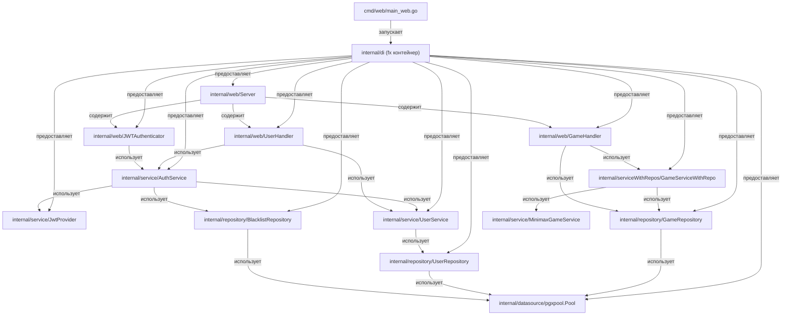

```mermaid
graph TD
    Main["cmd/web/main_web.go"] -->|запускает| DI["internal/di (fx контейнер)"]
    DI -->|предоставляет| Server["internal/web/Server"]
    DI -->|предоставляет| GameHandler["internal/web/GameHandler"]
    DI -->|предоставляет| UserHandler["internal/web/UserHandler"]
    DI -->|предоставляет| JWTAuth["internal/web/JWTAuthenticator"]
    DI -->|предоставляет| GameSvc["internal/serviceWithRepos/GameServiceWithRepo"]
    DI -->|предоставляет| AuthSvc["internal/service/AuthService"]
    DI -->|предоставляет| JwtProv["internal/service/JwtProvider"]
    DI -->|предоставляет| UserSvc["internal/service/UserService"]
    DI -->|предоставляет| GameRepo["internal/repository/GameRepository"]
    DI -->|предоставляет| UserRepo["internal/repository/UserRepository"]
    DI -->|предоставляет| BlackRepo["internal/repository/BlacklistRepository"]
    DI -->|предоставляет| PgPool["internal/datasource/pgxpool.Pool"]

    GameSvc -->|использует| GameRepo
    GameSvc -->|использует| Minimax["internal/service/MinimaxGameService"]

    AuthSvc -->|использует| UserSvc
    AuthSvc -->|использует| JwtProv
    AuthSvc -->|использует| BlackRepo

    UserSvc -->|использует| UserRepo

    GameRepo -->|использует| PgPool
    UserRepo -->|использует| PgPool
    BlackRepo -->|использует| PgPool

    GameHandler -->|использует| GameSvc
    GameHandler -->|использует| GameRepo

    UserHandler -->|использует| AuthSvc
    UserHandler -->|использует| UserSvc

    JWTAuth -->|использует| AuthSvc

    Server -->|содержит| GameHandler
    Server -->|содержит| UserHandler
    Server -->|содержит| JWTAuth
```