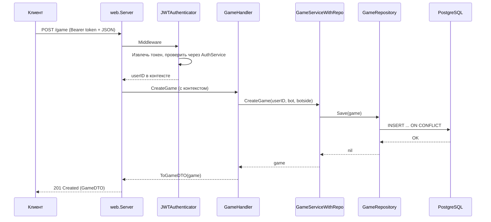

```mermaid
sequenceDiagram
    participant Client as Клиент
    participant Server as web.Server
    participant Auth as JWTAuthenticator
    participant Handler as GameHandler
    participant GameSvc as GameServiceWithRepo
    participant Repo as GameRepository
    participant DB as PostgreSQL

    Client->>Server: POST /game (Bearer token + JSON)
    Server->>Auth: Middleware
    Auth->>Auth: Извлечь токен, проверить через AuthService
    Auth-->>Server: userID в контексте
    Server->>Handler: CreateGame (с контекстом)
    Handler->>GameSvc: CreateGame(userID, bot, botside)
    GameSvc->>Repo: Save(game)
    Repo->>DB: INSERT ... ON CONFLICT
    DB-->>Repo: OK
    Repo-->>GameSvc: nil
    GameSvc-->>Handler: game
    Handler-->>Server: ToGameDTO(game)
    Server-->>Client: 201 Created (GameDTO)
```